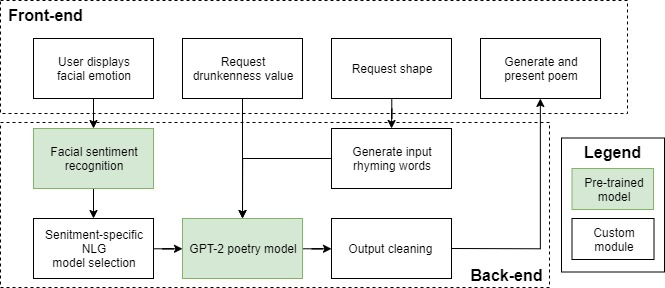
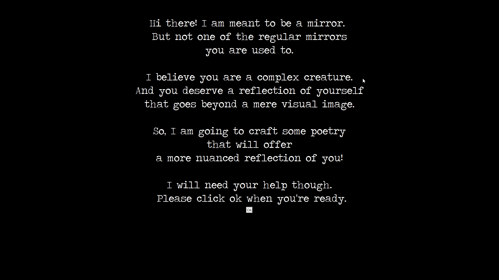
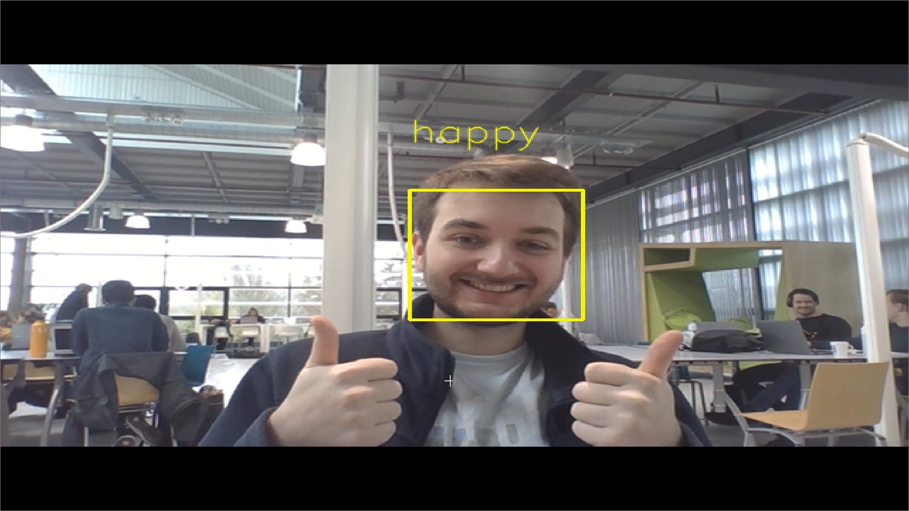
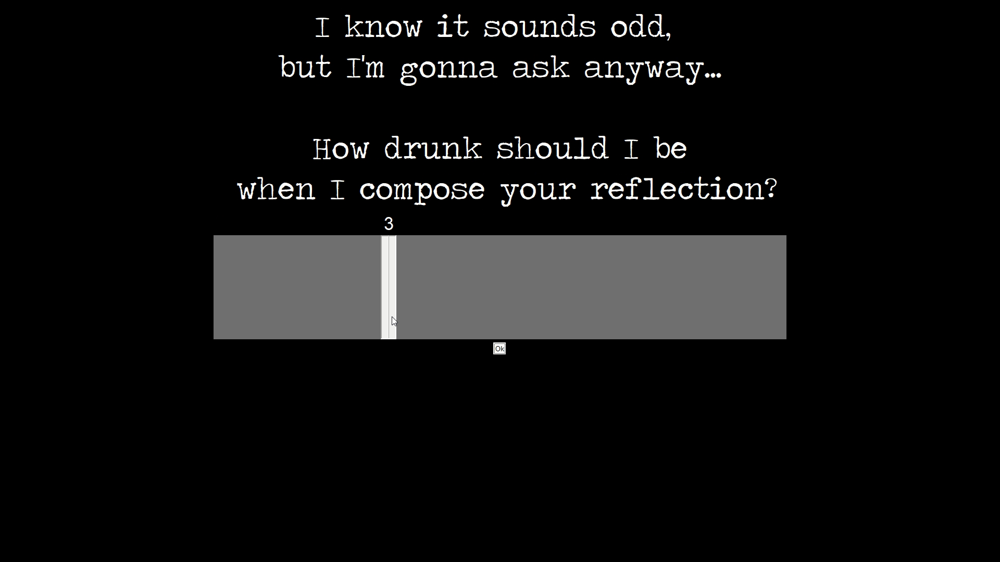
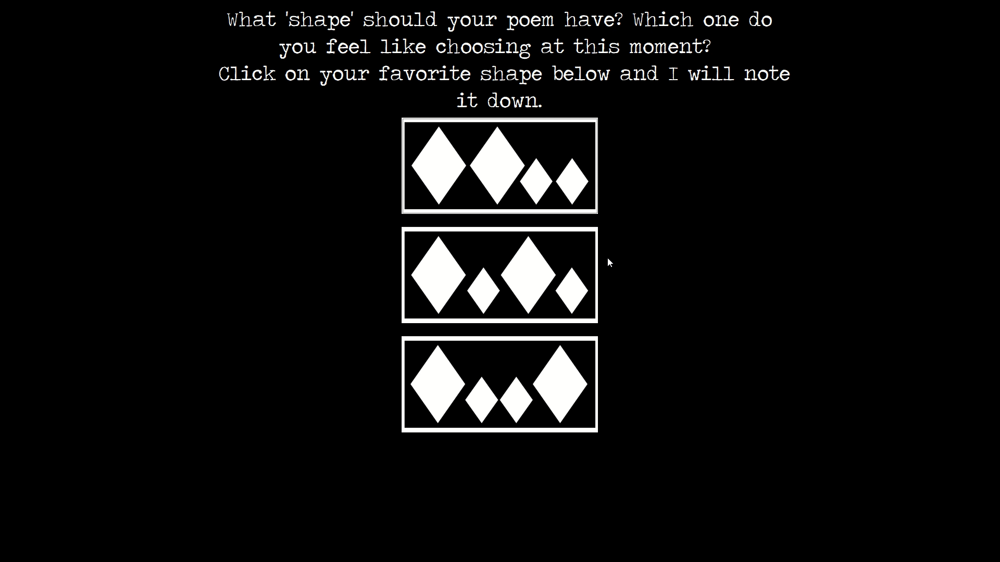
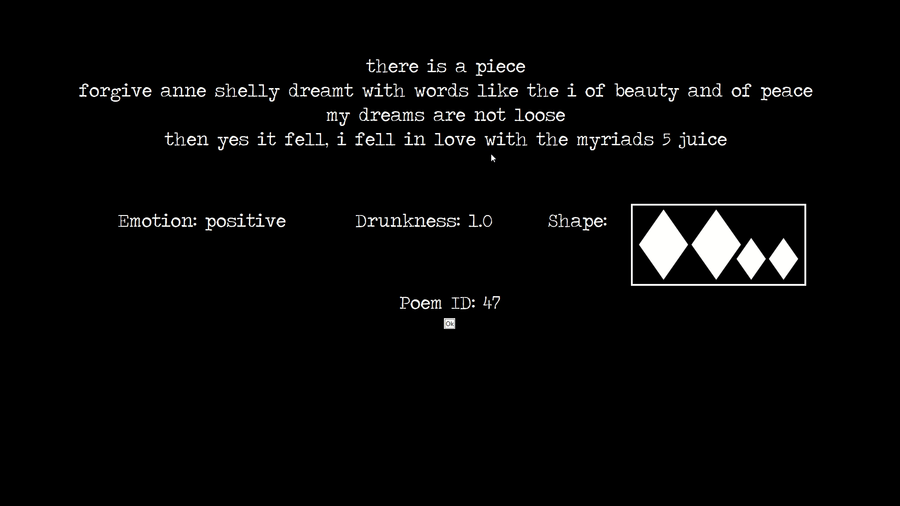

# PoetryMirror: Uses natural language generation, user emotions and co-creation to generate affective, poetic user reflections

PoetryMirror is a novel tool that reflects a user’s current inner state through poetry. PoetryMirror’s testing showed that users felt that their generated poems were influenced by them and reflected them. It was perceived as highly interesting, and it led to several guidelines for designing interactive, natural language generation applications. This project will be exhibited at a museum in Enschede as well.

The main running file is *src/run_gui.py*

The project has gratefully made use of [OpenAI's gpt-2 model](https://github.com/openai/gpt-2), [NLTK's VADER](https://www.nltk.org/howto/sentiment.html) and [oarriaga's face_classification project](https://github.com/oarriaga/face_classification).

For details on the process and results of this project, read [full research paper](https://www.researchgate.net/publication/338987902_PoetryMirror_An_Affective_Poetic_Reflection_of_You_Through_Natural_Language_Generation).

### The approach:

### An impression:

